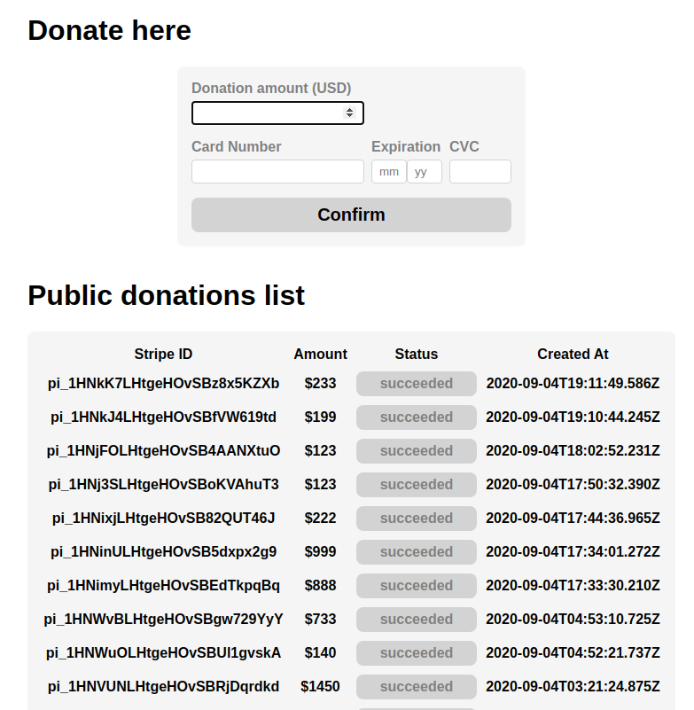

### Omella Coding Challenge

This is a project that provides a little payment form via Stripe.
It displays the list of payments and also receives Stripe status updates via webhook.

This is the technology stack:

- Frontend:
  - Typescript
  - Webpack/ts-loader
  - React
  - Styled components

- Backend:
  - Ruby on Rails
  - PostgreSQL
  - RSpec

### About the decisions taken

I tried keeping my approach minimal and simple, but at the sime time give you an idea of how I would organize code at larger scale.

For the backend I just used Rails controllers to implement a few JSON endpoints.
I organized business logic using again a barebones implementation of business actions.
I put as much integrity checks as possible on the DB layer.   

For the frontend I decided to try and do my first Typescript/Webpack project.
The setup was mostly painless, but I got to spend some time understanding how to deal with 3rd party package typing errors.

### Test cards

For test card numbers I've used the ones mentioned at https://github.com/stripe-samples/accept-a-card-payment#accepting-a-card-payment.

### Setup

In order to create payment methods from the backend, we need a Stripe account with a **verified phone**.
For this step you can visit https://dashboard.stripe.com/phone-verification .
The project is configured with my own Stripe account which has one, but this setup has it's limitations.

For frontend:

~~~bash
yarn install
yarn start # spins up a development server at https://localhost:8080
~~~

For backend:

~~~bash
bundle install
rails server
~~~

#### Configuring webhook

This part is tricky. You can't use my account because to configure the webhook you either need access to my account's dashboard, or need to use Stripe CLI which authenticates using a browser popup.

The easiest solution may be to install Stripe CLI (https://stripe.com/docs/stripe-cli#install) and use your own Stripe test account.

Configure the backend to use your account by writing the *secret* key to do the `.env` file:

~~~bash
STRIPE_KEY=<your secret key>
~~~

Then run in the console:

~~~bash
stripe listen --forward-to localhost:3000/payments/webhook
~~~

### Running backend tests

I've included some unit tests for the backend, just to check that some tricky parts worked well.

~~~
rspec
~~~
